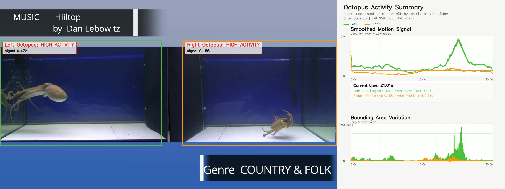
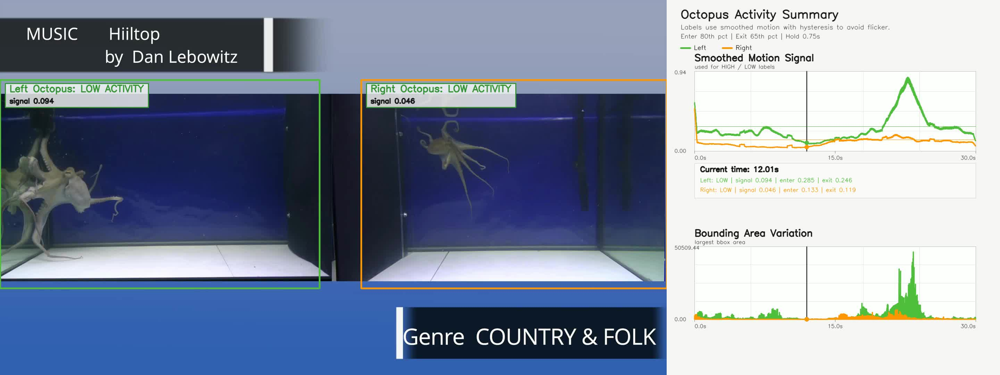

# Sentiment Analysis of Cephalopods

This repository is for the Catrobat GSOC 2026 entry task. It extracts behavioral signals from a short video clip of two octopi reacting to music. The analysis is implemented in a Jupyter notebook and focuses on per-octopus motion intensity and motion-based bounding-area variation inside manually defined left and right ROIs.

The source video is from Octolab TV on Youtube. I chose it because I thought the static camera and blank tank setup would best resemble the conditions of an octopus research lab. https://youtu.be/eqMSzqoYoRA

## Summary Video

[Open the rendered summary video](octopus_activity_summary.mp4)

<video src="octopus_activity_summary.mp4" controls width="100%"></video>

[](octopus_activity_summary.mp4)

## Repository Contents

- `octopus_behavior_analysis.ipynb`: main notebook for loading the video, defining ROIs, extracting features, plotting results, and rendering a summary video
- `octopus.mp4`: included sample video used for the analysis
- `octopus_activity_summary.mp4`: generated side-by-side summary video with activity labels and live graphs
- `docs/summary_frame_12s.jpg`: example low-activity frame from the rendered summary video
- `docs/summary_frame_21s.jpg`: example high-activity frame from the rendered summary video

## Setup

Create and activate a Python environment, then install the required packages:

```bash
python -m venv .venv
source .venv/bin/activate
python -m pip install --upgrade pip
python -m pip install notebook opencv-python numpy matplotlib
```

Launch the notebook:

```bash
jupyter notebook octopus_behavior_analysis.ipynb
```

If you use VS Code, open the notebook there and select the same environment as the notebook kernel.

## Data

The small sample video is already included in this repository as `octopus.mp4`, so no separate download step is required.

## Implemented Features

- Video loading and metadata inspection with OpenCV
- Manual left and right ROI definition for separate octopus analysis
- Frame-to-frame motion magnitude using mean absolute grayscale difference
- Motion-based bounding-area variation using thresholded frame differencing and contour bounding boxes
- Left versus right time-series plots for both feature types
- Diagnostic ROI visualization
- Summary video export with side-by-side graphs and smoothed `HIGH ACTIVITY` / `LOW ACTIVITY` labels

## How To Run

Run the notebook top to bottom. The final two code cells generate `octopus_activity_summary.mp4` and attempt to display it inline in the notebook. If your notebook viewer does not render the video reliably, open the generated MP4 directly in Finder, Quick Look, or QuickTime.

## Short Analysis

The two selected features capture complementary aspects of visible behavior in a simple and interpretable way. Frame-to-frame motion magnitude reflects how much each octopus is moving inside its ROI, so it is useful for detecting bursts of activity, locomotion, and large arm motions. Bounding-area variation provides a coarse proxy for posture change, because the moving region typically expands when the body spreads out or the arms extend and contracts when the animal becomes more compact. Together, these signals can separate relatively still periods from active bouts and can reveal differences between the left and right octopus over time. The main limitation is that both features are approximate and depend on motion differencing, so they are sensitive to threshold choice, reflections, compression artifacts, and any background change that produces pixel motion. They also do not identify specific behaviors directly, because different actions can produce similar motion and area traces. Additional posture-aware measurements such as body centroid, arm extension, or shape descriptors would make the inference more behaviorally specific, while audio could help align movement bursts with external events or disturbances that are not visible in the frame.

## Sample Screenshots

Low-activity example:



High-activity example:


